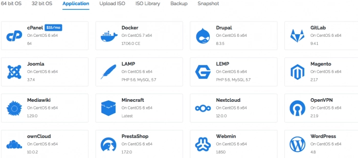
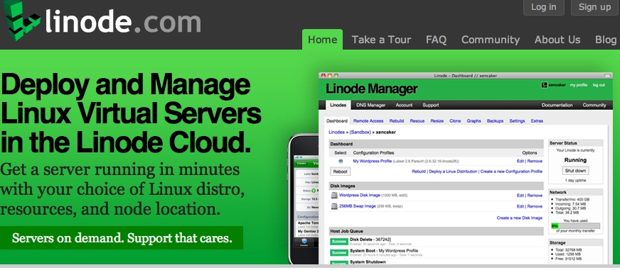
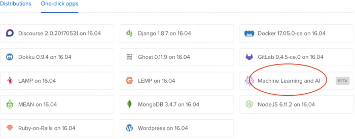

# 三大VPS横评：Vultr、Linode和DigitalOcean谁更值得买？

---

看够了那些过时的VPS评测文章了吗？VPS市场变化太快，每隔几个月就有新的价格调整和功能更新。作为一个同时在用Vultr、Linode和DigitalOcean的人，我决定用最直接的方式——对比表格，把这三家的真实情况摆出来。数据会定期更新，省得你到处找过期信息。

如果你正在找一个性价比高、部署快、覆盖全球的VPS方案，这篇文章能帮你快速做决定。

---

## Vultr：价格杀手，入门首选

Vultr最大的优势就是便宜，2.5美元套餐虽然经常缺货，但5美元档的配置已经能满足大多数轻量应用需求。控制面板里内置了大量一键部署应用，适合快速搭建各种服务。

| Vultr（2014年成立） | $5/月套餐 | $10/月套餐 | $20/月套餐 |
|---|---|---|---|
| **配置** | 25GB SSD 1核CPU 1GB内存 1TB流量 | 40GB SSD 1核CPU 2GB内存 2TB流量 | 60GB SSD 2核CPU 4GB内存 3TB流量 |
| **虚拟化技术** | KVM架构 支持多种VPN协议 | 支持Windows Server | 支持Google BBR加速 |
| **网络** | 1Gbps带宽 1个IPv4 | 支持IPv6 | 全球多节点 |
| **数据中心位置** | 美国：洛杉矶、西雅图 硅谷、迈阿密 | 美国：纽约、芝加哥 亚特兰大、达拉斯 | 亚太：新加坡、东京、悉尼 欧洲：阿姆斯特丹、伦敦 法兰克福、巴黎 |
| **付款方式** | 信用卡、PayPal、支付宝 | 优惠码：SSDVPS | 按小时计费 |

对于个人开发者或者小团队来说，Vultr的灵活计费方式很友好——用多少算多少，不用的时候删掉就不扣费了。👉 [想试试全球节点最多、价格最灵活的VPS？](https://www.vultr.com/?ref=9738262-9J)

---

## Linode：老牌稳定，企业级可靠

Linode从2003年就开始做VPS了，在圈内口碑一直不错。去年升级到KVM架构后，最低5美元套餐的性价比也上来了。如果你需要一个长期稳定的服务器，Linode是个保险的选择。

| Linode（2003年成立） | $5/月套餐 | $10/月套餐 | $20/月套餐 |
|---|---|---|---|
| **配置** | 25GB SSD 1核CPU 1GB内存 1TB流量 | 50GB SSD 1核CPU 2GB内存 2TB流量 | 80GB SSD 2核CPU 4GB内存 4TB流量 |
| **虚拟化技术** | KVM架构 支持多种VPN协议 | 支持Windows Server | 支持Google BBR加速 |
| **网络** | 40Gbps入站 1Gbps出站 | 1个IPv4 支持IPv6 | 高性能网络 |
| **数据中心位置** | 美国：弗里蒙特、达拉斯 亚特兰大、纽瓦克 | 欧洲：伦敦、法兰克福 | 亚太：新加坡、东京 印度孟买 |
| **付款方式** | 信用卡、PayPal | 优惠码：DOCS10 / LINODE10 | 不支持比特币 |

Linode的网络质量在三家里算最稳的，特别是出站带宽只有1Gbps但入站能到40Gbps，适合需要处理大量下载请求的场景。

---

## DigitalOcean：性能狂魔，北美最强

DigitalOcean的特点是快，性能表现非常稳定。虽然数据中心数量比Vultr少（主要集中在北美），但如果你的用户群在美国或加拿大，DO是不二之选。另外它的软件库里还提供了机器学习相关工具，对开发者很友好。

| DigitalOcean（2012年成立） | $5/月套餐 | $10/月套餐 | $20/月套餐 |
|---|---|---|---|
| **配置** | 25GB SSD 1核CPU 1GB内存 1TB流量 | 50GB SSD 1核CPU 2GB内存 2TB流量 | 80GB SSD 2核CPU 4GB内存 4TB流量 |
| **虚拟化技术** | KVM架构 支持多种VPN协议 | 支持Windows Server | 支持Google BBR加速 |
| **网络** | 1Gbps带宽 | 1个IPv4 支持IPv6 | 高性能SSD |
| **数据中心位置** | 北美：纽约、旧金山 多伦多 | 亚太：新加坡 印度班加罗尔 | 欧洲：法兰克福 阿姆斯特丹、伦敦 |
| **付款方式** | 信用卡 | 优惠码：lowendbox | 不支持PayPal和比特币 |

需要注意的是，DO不支持PayPal付款，这点对部分用户可能不太方便。但如果你有信用卡，它的性能绝对对得起价格。

---

## 最后提醒

上面列出的三家VPS官方都不直接支持Windows Server环境。如果你一定要装Windows，需要用Grub legacy模式或者找特定教程手动安装。另外，使用非正版Windows可能导致账号被投诉甚至封禁，建议谨慎操作。

选VPS就像选工具，没有绝对的好坏，只有合不合适。Vultr适合需要灵活部署、全球节点覆盖的场景；Linode适合追求长期稳定、企业级可靠性的用户；DigitalOcean则是性能党的首选。根据你的实际需求来选，别被单纯的价格数字迷惑。如果还在纠结从哪家开始，👉 [Vultr的全球节点和按小时计费](https://www.vultr.com/?ref=9738262-9J)确实是个低风险的试水选择。

祝你找到最适合自己的VPS，搭建愉快 🙂
